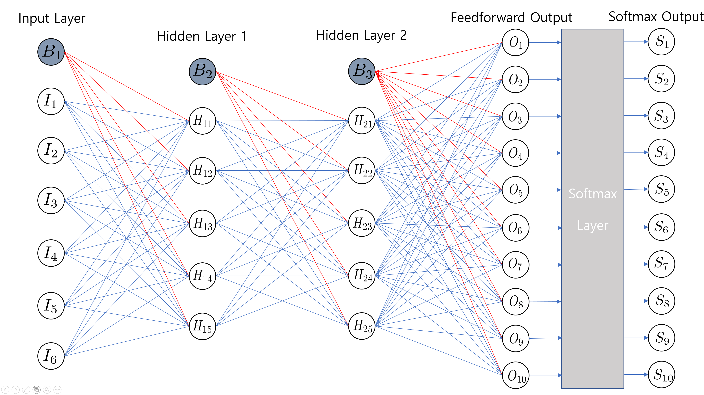
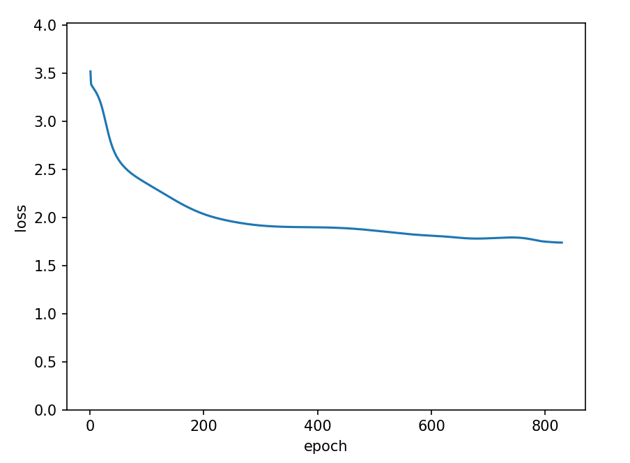

# scratch-neural-network
## 1. Introduction
- 넘파이와 판다스로 간단히 구현한 뉴럴 네트워크입니다.
- 프로야구 데이터를 통해, 각 팀별 순위를 예측하는 프로그램입니다.

## 2. Dataset
- 모든 데이터는 [스탯티즈](http://www.statiz.co.kr/)를 참고하여 직접 만든 데이터입니다. (양이 많지 않아 크롤링은 하지 않음)

### 2-1. Train
- Input: 팀별 AVG, OBP, SLG, ERA, FIP, WHIP를 리그의 평균값으로 나눈 값이 들어갑니다.
- Output: 등수에 대한 예측 확률이 원-핫 벡터 형태로 나옵니다.
### 3-2. Test
- 2022시즌 전반기까지의 데이터를 통해 테스트를 진행하였습니다.

## 3. Neural-Network
### 3-1. 구조도


- Input Layer: 1개
- Hidden Layer: 2개
- Output Layer: 1개
  
6개의 값이 Input Layer로 들어와서 2개의 Hidden Layer를 거치고 softmax 연산을 통해, 최종 로짓값이 생성됩니다.


### 3-2. Hyper Parameter
- learning Rate: 0.01
- epoch: 829
- loss function: Cross Entrophy
- activation function: sigmoid

## 4. Result
### 4-1. 학습과정


- 위 그래프는 epoch당 loss의 변화를 보여줍니다.
- 해당 epoch를 넘어가면 loss가 다시 오르는 현상이 발생하여 해당 epoch까지 학습시켰습니다.

### 4-2. 분석 결과


- 첫번째는 각팀별 예측 등수 top3이고 두번째는 각팀별 예측되는 등수의 확률입니다.
- 칼럼은 현재(2022년 7월 19일 기준) 순위 순서대로입니다.
- 대체로 현재 순위와 비슷하게 예측이 됩니다.

자세한 정보는 여기를 [참고](./analysis.ipynb)하세요.

## 5. Getting Started
```
pip install -r requirements.txt

python main.py
```

## 6. More Information
- TODO

## Reference
CE loss & softmax 역전파 미분 증명
- https://towardsdatascience.com/deriving-backpropagation-with-cross-entropy-loss-d24811edeaf9
- https://www.mldawn.com/back-propagation-with-cross-entropy-and-softmax/